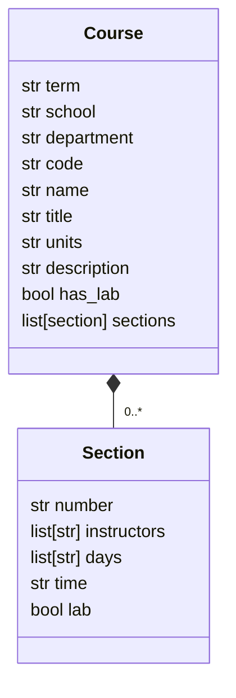

# Course Catalog Scraper

This directory contains the pipeline for scraping the course catalog from the registrar's website. Running `./scraper/scrape.sh` from the root directory of the project will run the entire pipeline.

It works in a few stages:

1. Based on the list of schools and departments in `schools.json`, `scrape.py` downloads the HTML page for each school/department to `pages/`
1. `transform.sh` processes each HTML page into a CSV by using `tidy` to convert the page into XHTML and then using the XSL transforms from `xsl/` to turn those in to CSVs.
1. `aggregate.py` aggregates and cleans the CSVs and produces a single parquet course catalog with the following schema:

